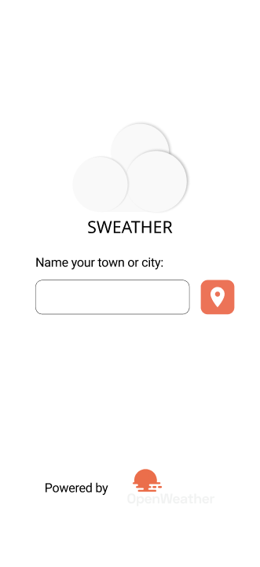

# Sweather

## Index
- [Sweather](#sweather)
  - [Index](#index)
  - [Introduction](#introduction)
  - [Features](#features)
  - [Installation](#installation)
  - [Usage](#usage)
  - [Testing](#testing)
    - [Unit tests](#unit-tests)
    - [HTTP Requests](#http-requests)
  - [Technologies](#technologies)
  - [Architecture](#architecture)
  - [Android Build](#android-build)
  - [Further information](#further-information)

## Introduction
**Sweather** is a weather app that can be used to get the current weather in a city. It is a simple, yet powerful application. 

Sweather stands for "**S**imple **weather**".
<p align="center">
  
  
</p>

The main goal behind this project is to learn React Native along with Figma prototyping by creating an app
that provides users valuable data. The [Figma design](https://www.figma.com/file/Jy1owSd3o2e8TZlySfW6eb/Sweather?node-id=0%3A1) was created in advance in order to have a clear idea of what the app should be before programming and to become a development challenge.

## Features
- Get the weather of a city specifying its name
- Get the weather of a city using the current location
- Dynamic weather details background, depending on the requested city
- Dark mode
- Spanish support

## Installation

Install the project node and npm version via `nvm` by using `nvm install`. 
Then install `yarn` in case you don't have it and add the following `.env` file:

```env
EXPO_PUBLIC_OPENWEATHER_API_KEY=XXXXXXXXX
EXPO_PUBLIC_OPENWEATHER_URL=XXXXXXXXX
EXPO_PUBLIC_UNSPLASH_API_KEY=XXXXXXXXX
EXPO_PUBLIC_UNSPLASH_URL=XXXXXXXXX
```

Once done this run `yarn install` to install the dependencies and... That's it!

## Usage

Feel free to run the app with `yarn start`.

## Testing

### Unit tests

You can run the unit tests using the command: 

```bash
yarn test
```

### HTTP Requests

With the [REST Client Extension](https://marketplace.visualstudio.com/items?itemName=humao.rest-client) you can test OpenWeather and Unsplash APIs. 
Please find them at [the tests folder](./tests/).

## Technologies

-   [TypeScript](https://www.typescriptlang.org/)
-   [React](https://es.reactjs.org/)
-   [React Native](https://reactnative.dev/)
-   [React Navigation](https://reactnavigation.org/)
-   [Expo](https://docs.expo.dev/)
-   [Unsplash API](https://unsplash.com/documentation)
-   [Openweather API](https://openweathermap.org/api)

## Architecture
Sweather architecture is composed by the following folders:

-   Components:
    The components used along all the app. These are basic components such as buttons, icons, etc. Some React Native components have been redefined at this folder, in order to customize them to allow light and dark modes.

-   Hooks:
    Autogenerated by Expo when creating the app. This folder contains the following hooks:
    - `useCachedResources`: This hook loads resources before the app starts and shows an splash screen.
    - `useColorScheme`: Retrieves if the system has a light or dark mode enabled.

    Wrappers for Weather and Wallpaper API calls:
    - `useWeatherForecast`: Retrieves weather and forecast data.
    - `useWallpaper`: Retrieves the wallpaper for a given location.

-   Navigation:
    It contains the navigation stack along with the routes.

-   Screens:
    Each folder represents the components used in each screen. The screens are:
    - `LocationRequest`: Shows an input where the user can enter its location. 
    - `LocationDetails`: Shows the weather of the selected location. 
    - `NotFound`: Route not found sample screen. Not used in the app. 

-   Services:
    - `Wallpaper`: Unsplash API wrapper for getting a wallpaper of a desired location. It searchs a location at Unsplash and gets one of the first images.
    - `Weather`: Given a string with the location or their coordinates, it retrieves the weather data.
  
-   Types:
    The type declaration for React Navigation.
  
-   Assets:
    The font and the images used in the app.

## Android Build

First, login in Expo Associated Services (EAS). The below commands should finally output the user's name.

```bash
npm i -g eas-cli
eas login
eas whoami
```

The default build format is enhanced for the Play Store, this is Android App Bundle (`.aab`). In case you want to generate an `apk` please create `eas.json` file.

Now you can run your build with the following command:

```bash
eas build -p android --profile preview
```

Note: you can name the profile whatever you like. We named the profile preview. However, you can call it local, emulator, or whatever makes the most sense for you.

## Further information
To learn more about React and React native, you can check the docs at the [Technologies](#technologies) section.