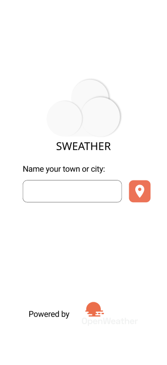

# Sweather

## Index
- [Sweather](#sweather)
  - [Index](#index)
  - [Introduction](#introduction)
  - [Features](#features)
  - [Installation](#installation)
  - [Technologies](#technologies)
  - [Architecture](#architecture)
  - [Further information](#further-information)

## Introduction
**Sweather** is a weather app that can be used to get the current weather in a city. It is a simple, yet powerful application. 

Sweather stands for "**S**imple **weather**".
<p align="center">
  
  
</p>
<!-- 
 -->

The main goal behind this project is to learn React Native along with Figma prototyping by creating an app
that provides users valuable data. The [Figma design](https://www.figma.com/file/Jy1owSd3o2e8TZlySfW6eb/Sweather?node-id=0%3A1) was created in advance in order to have a clear idea of what the app should be before programming and to become a development challenge.

## Features
- Get the weather of a city specifyng its name
- Get the weather of a city using the current location
- Dynamic weather details background, depending on the requested city
- Dark mode
- Spanish support (**TODO**)

## Installation

At the folder `config/` add a `global.ts` file with the following content:

```ts
const global = {
    WEATHER_API_KEY: "YOUR_WEATHER_API_KEY",
    WEATHER_URL: "YOUR_WEATHER_URL",
    UNSPLASH_API_KEY: "YOUR_UNSPLASH_API_KEY",
    UNSPLASH_URL: "YOUR_UNSPLASH_URL"
};

export default global;

```

Once done this run `yarn install` to install the dependencies and... That's it!

Feel free to run the app with `yarn start`.

## Technologies

-   [TypeScript](https://www.typescriptlang.org/)
-   [React](https://es.reactjs.org/)
-   [React Native](https://reactnative.dev/)
-   [React Navigation](https://reactnavigation.org/)
-   [Expo](https://docs.expo.dev/)

## Architecture
Sweather architecture is composed by the following folders:

-   Components:
    The components used along all the app. These are basic components such as buttons, icons, etc. Some React Native components have been redefined at this folder, in order to customize them to allow light and dark modes.

-   Hooks:
    Autogenerated by Expo when creating the app. This folder contains the following hooks:
    - `useCachedResources`: This hook loads resources before the app starts and shows an splash screen.
    - `useColorScheme`: Retrieves if the system has a light or dark mode enabled.

-   Navigation:
    It contains the navigation stack along with the routes.

-   Screens:
    Each folder represents the components used in each screen. The screens are:
    - `LocationRequest`: Shows an input where the user can enter its location. 
    - `LocationDetails`: Shows the weather of the selected location. 
    - `NotFound`: Route not found sample screen. Not used in the app. 

-   Services:
    - `Wallpaper`: Unsplash API wrapper for getting a wallpaper of a desired location. It searchs a location at Unsplash and gets one of the first images.
    - `Weather`: Given a string with the location or their coordinates, it retrieves the weather data.
  
-   Types:
    The type declaration for React Navigation.
  
-   Assets:
    The font and the images used in the app.

## Further information
To learn more about React and React native, you can check the docs at the [Technologies](#technologies) section.